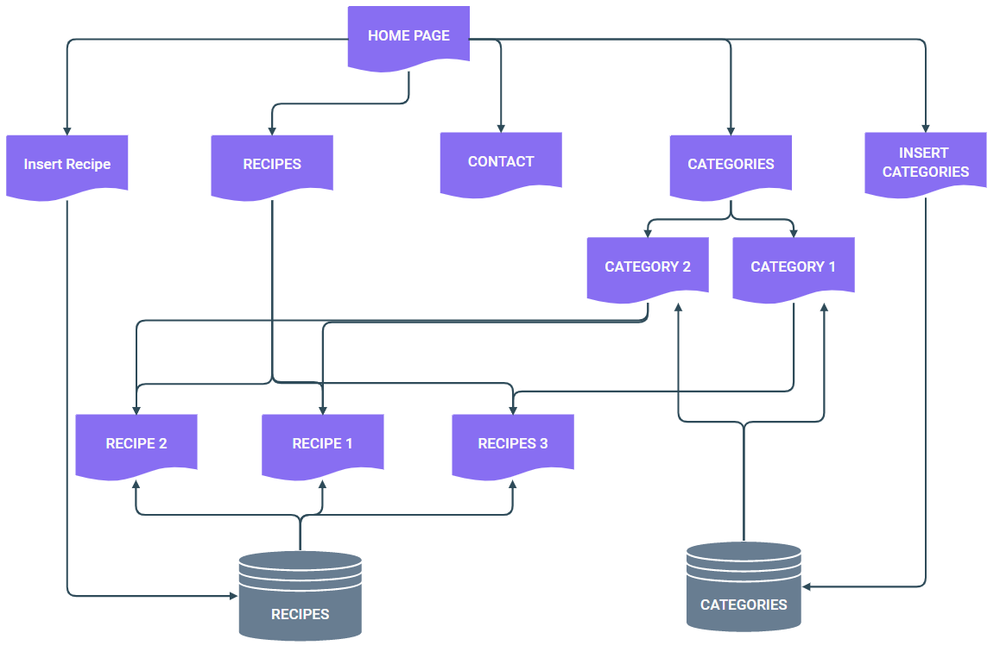
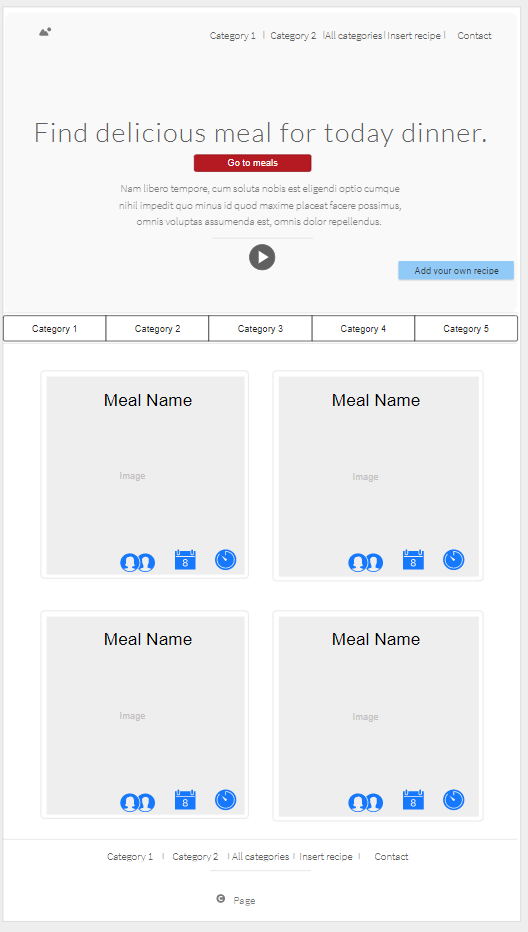
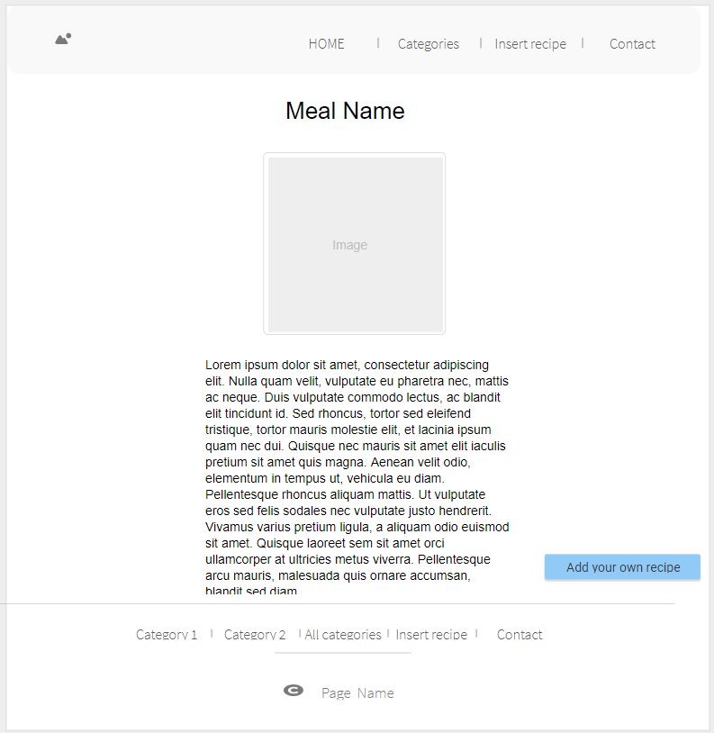
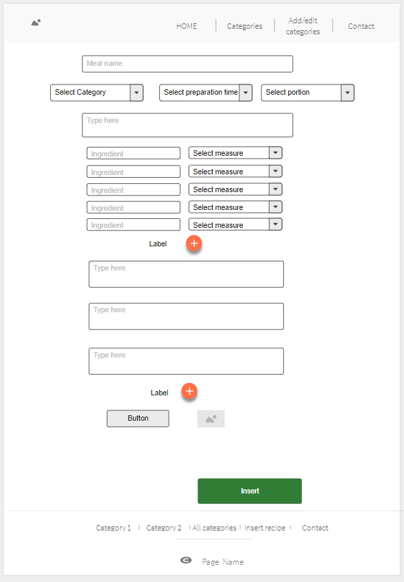
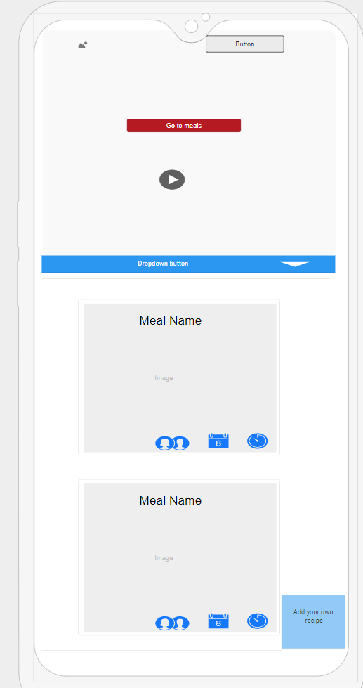

# cdins-msp3-recipe-book - Code Institute Milestone Project 3 - Recipe Book

Recipe book is a project of website with meals recipes. Project is a practicing the skills of python, flask and mongoDB during my study of Full Stack Web Development in Code Institiute.

## UX

### Strategy

The main goal of this project is to give for the users nice modern look website with meals recipes. Other goal is to give possibility for users to add the meals recipes which will be displayed on a webpage. I have done research and below user stories describe the user needs for my webpage. 

#### User Stories:

I identified 3 group of user for my project. People between the age of 25 and 45 and people over the age of 45. My user stories are pieces of conversation about a website.

#### People between the age of 25 and 45:

1. Propably i could use that kind of site to find idea for dinner, so i would like to see straight away delicious meals on the first page. Inserting recipes must be easy.
2. When i will find a recipe i would like to print the shopping list.
3. I would like to find recipes based on the ingredients which i have at home.
4. I wish to select the meals depence of the quantity of ingredients and the preparation time.
5. The recipe needs to have picture, ingredients list and preparation steps.

#### People over the age of 45:

1. I would like to have place in the internet when i can find meal recipes as a plain text, not video, i cannot cook and watch. I prefer to read the recipe. The first view of page? - I want to see there good ideas for a dinner. Ingredients must be shown definitevly in piece, spoons and glasses, weight is good for people who is on a diet. I like to eat well.
2.  I still have my notebook with recipes - i like to look in to the piece of paper during cooking. Printing the recipe from web it could be a good feature. I could share my notebook, if inserting recipes will be easy i could put my recipes to internet eb by myself.
3. Pictures are not really necessary if the title and description is good.

### Scope

Taking to consideration the above user stories i identified below requirements:

#### Functional Requirements:
1. The project must be a multi webpage with main page, page for adding recipes and single recipe page.
2. Each recipes needs to be able to open as a single webpage.
3. Website must be accesible from different devices.
4. Inserting new recipe must be easy and intuitive:
    * selecting category from list
    * selecting preparation time from list
    * selecting portions quantity from list
    * typing meal name
    * description, but not required
    * typing ingredients
    * type ingredients quantity
    * select measure (grams, pieces, spoons, )
    * 5 fields in default and plus button for more ingredients fields
    * preparation typed in steps with 3 default and button for adding next step
    * button for uploading image
    * save button
5. User has to have possibility to download/print ingredients list.
6. User needs to have possibility to browse recipes by different categories.
7. Navigation bar needs to display categories.

#### Design Requirements:

1. Main page should display big photo or video of cooking meal as background. 
2. On the front of page needs to be big button with find recipe text which is going to move user to middle of webiste - where the recipes will be.
3. In middle of website should be displayed recipes in 2 or 3 columns in big screens and 1 column on the small screens.
4. Recipes needs to be displayed with photo, title and icons for preparation time and portions quantity.
5. By clicking on meal image is turning in to the ingredients list and preparation steps with button to open recipe in new window.
6. Menu needs to be small but visible.

#### Content Requirements:

1. Recipe should described:
    * category
    * preparation time
    * portions quantity
    * meal name
    * description
    * ingredients
    * ingredients quantity
    * ingredient measure (grams, pieces, spoons, )
    * image
2. Rrecipes needs to be displayed on main page.
3. Meals has to be organized by different categories:
    * cold meals
    * hot meals
    * drinks
    * desserts

### Structure

### Skeleton

#### Desktop

#### Mobile

### Surface

#### Main picture

As a end of the designing my webpage i decide to choose the main image/movie which will be displayed on the main page and then matching colors scheme. 
I wanted to put a picture that arouses appetite and ecourages cooking. This is what I found.

#### Colours

Based on the main pictures and using the Huesnap tool[Huesnap.com] I selected below color scheme for my website.

1. #5e8b4a
2. #ca2545
3. #a57255
4. #0a0904

#### Fonts

I choose two combinaion of fonts which i like before creating a webpage. I take to consideration that it could look different in the end effect than i imagined. 

<link href="https://fonts.googleapis.com/css?family=Archivo+Black|Judson:400,700" rel="stylesheet">
body {
 font-family: 'Judson', serif;
}

h1, h2, h3, h4, h5, h6 {
 font-family: 'Archivo Black', sans-serif;
}

<link href="https://fonts.googleapis.com/css?family=Abril+Fatface|Roboto:300,700" rel="stylesheet">
body {
 font-family: 'Roboto', sans-serif;
 font-weight: 300;
}

h1, h2, h3, h4, h5, h6 {
 font-family: 'Abril Fatface', serif;
}

## Features

1. Insert recipe to the database.
2. Add recipe image.
3. Printing recipe.
4. Sending recipe by email.

## Technologies Used

* python
* flask
* Bootstra 5 Alpha
* CSS
* HTML
* JAVASCRIPT
* BOOTSTRAP ICONS
* GOOGLE FONT
* MONGODB
* HERKOU as deployment service
* Git for version control
* github

## Testing

## Deployment

## Credits

