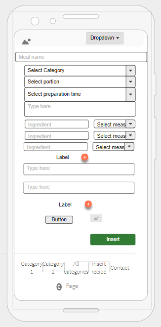
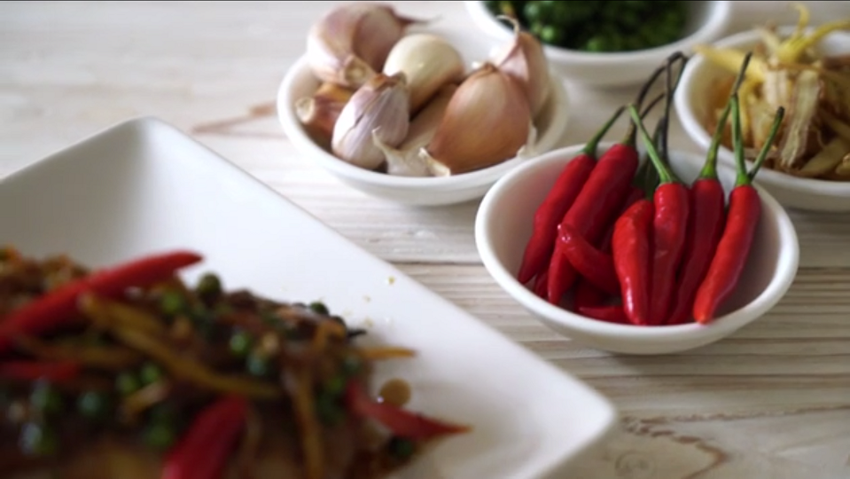
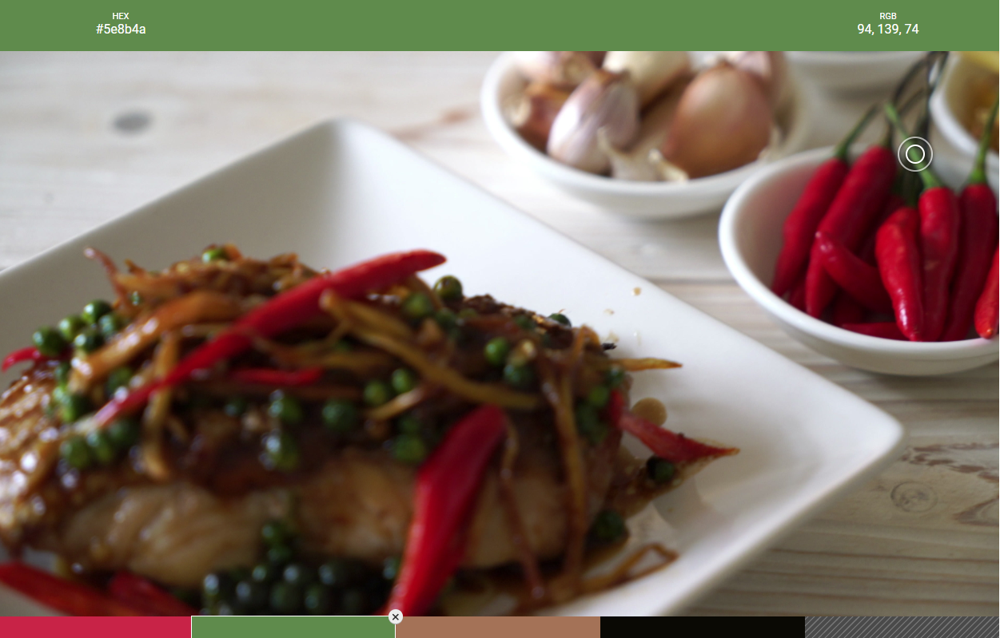

# cdins-msp3-recipe-book - Code Institute Milestone Project 3 - Recipe Book

Recipe book is a project of website with meals recipes. Project is a practicing the skills of python, flask and mongoDB during my study of Full Stack Web Development in Code Institiute. 

## UX

### Strategy

The main goal of this project is to give for the users nice looked website with meals recipes. Other goal is to give possibility for users to add the meals recipes which will be displayed on a webpage. I have done research and below user stories describe the user needs for my webpage. 

#### User Stories:

I identified 3 group of user for my project. People between the age of 25 and 45 and people over the age of 45. My user stories are pieces of conversation about a website.

#### People between the age of 25 and 45:

1. Propably i could use that kind of site to find idea for dinner, so i would like to see straight away delicious meals on the first page. Inserting recipes must be easy.
2. When i will find a recipe i would like to print the shopping list.
3. I would like to find recipes based on the ingredients which i have at home.
4. I wish to select the meals depence of the quantity of ingredients and the preparation time.
5. The recipe needs to have picture, ingredients list and preparation steps.

#### People over the age of 45:

1. I would like to have place in the internet when i can find meal recipes as a plain text, not video, i cannot cook and watch. I prefer to read the recipe first and then cook. The first view of page? - I want to see there good ideas for a dinner. Ingredients must be shown definitevly in piece, spoons and glasses, weight is good for people who is on a diet. I like to eat well.
2.  I still have my notebook with recipes - i like to look in to the piece of paper during cooking. Printing the recipe from web it could be a good feature. I could share my notebook, if inserting recipes will be easy i could put my recipes to internet by myself.
3. Pictures are not really necessary if the title and description is good.

### Scope

Taking to consideration the above user stories i identified below requirements:

#### Functional Requirements:
1. The project must be a multi webpage with main page, page for adding recipes and single recipe page.
2. Each recipes needs to be able to open as a single webpage.
3. Website must be accesible from different devices.
4. Inserting new recipe must be easy and intuitive:
    * selecting category from list
    * selecting preparation time from list
    * selecting portions quantity from list
    * typing meal name
    * description, but not required
    * typing ingredients
    * type ingredients quantity
    * select measure (grams, pieces, spoons, )
    * 5 fields in default and plus button for more ingredients fields (during creating page i decide to display only 3 fields in default and create plus/minus buttons to add or remove fields)
    * preparation typed in steps with 3 default and button for adding next step (during creating page i decide to display only 1 fields in default and create plus/minus buttons to add or remove fields)
    * button for uploading image
    * save button
5. User has to have possibility to download/print ingredients list.
6. User needs to have possibility to browse recipes by different categories.
7. Navigation bar needs to display categories.

#### Design Requirements:

1. Main page should display big photo or video of cooking meal as background. 
2. On the front of page needs to be big button with find recipe text which is going to move user to middle of webiste - where the recipes will be.
3. In middle of website should be displayed recipes in 2 or 3 columns in big screens and 1 column on the small screens.
4. Recipes needs to be displayed with photo, title and icons for preparation time and portions quantity.
5. By clicking on meal image is turning in to the ingredients list and preparation steps with button to open recipe in new window.
6. Menu needs to be small but visible.

#### Content Requirements:

1. Recipe should described:
    * category
    * preparation time
    * portions quantity
    * meal name
    * description
    * ingredients
    * ingredients quantity
    * ingredient measure (grams, pieces, spoons, )
    * image
2. Rrecipes needs to be displayed on main page.
3. Meals has to be organized by different categories:
    * cold meals
    * hot meals
    * drinks
    * desserts

### Structure

Scheme of database structure were changed a bit - due to low number of categories i resign from keeping these in database. 
Instead i create collection with ingredients to give in future possibility for autocomplete ingredients fields during adding recipe to raise user experience.
### Skeleton

#### Desktop

#### Mobile

### Surface

#### Main picture

As a end of the designing my webpage i decide to choose the main image/movie which will be displayed on the main page and then matching colors scheme. 
I wanted to put a picture that arouses appetite and ecourages cooking. This is what I found.

#### Colours

Based on the main pictures and using the Huesnap tool[Huesnap.com] I selected below color scheme for my website.

1. #5e8b4a
2. #ca2545
3. #a57255
4. #0a0904

#### Fonts

I choose two combinaion of fonts which i like before creating a webpage. I take to consideration that it could look different in the end effect than i imagined. 

<link href="https://fonts.googleapis.com/css?family=Archivo+Black|Judson:400,700" rel="stylesheet">
body {
 font-family: 'Judson', serif;
}

h1, h2, h3, h4, h5, h6 {
 font-family: 'Archivo Black', sans-serif;
}

<link href="https://fonts.googleapis.com/css?family=Abril+Fatface|Roboto:300,700" rel="stylesheet">
body {
 font-family: 'Roboto', sans-serif;
 font-weight: 300;
}

h1, h2, h3, h4, h5, h6 {
 font-family: 'Abril Fatface', serif;
}

## Features

1. Insert recipe to the database - allows users to add own recipes.
2. Add recipe image - allows users to add meal image to the recipes
3. Printing recipe - allows users to print recipe without navigation bar and footer - only clean reicpe page.
4. Sending recipe by email - allows users to send recipe to email.
5. Contact form - allows users to leave contact message.
6. Navigation bar - allows users to easily navigate the site.
7. Display recipes by categories - Big navigation bar above the recipes allows users to select categories to display recipes only from selected category.
8. Icons displayed below each recipe with portion quantity, preparation time, type of meal and number of ingredients - Allows users to find quickly what kind of meal it is, how long it takes to prepare, for how many people it is and how many ingredients is used to prepare.
9. Inserting ingredients name to ingredients base during inserting new recipe.

## Features left to implement
1. Download recipe as PDF.
2. Option to select recipes by number of ingredients.
3. Create autocomplete function for typing ingredients with database ingredient collection as source.

## Technologies Used

* python - provides background logic on website
* flask - allowed to display python logic in web browser
* MongoDB - python extension for manipulation mongoDB database
* Flask-WTF - flask forms used to display and take data from contact and add recipe forms.
* Flask-Mail - used to send email messages
* Bootstrap 5 Alpha - used to create layout of the pages, navigation bar and footer.
* CSS - provide website style
* HTML - provides content of the website
* JAVASCRIPT - provides function for interaction users with website
* BOOTSTRAP ICONS - used to enhance the user experience
* GOOGLE FONT - provides main fonts for website
* MONGODB - Database for storing recipes
* HERKOU - deployment service
* Git for version control
* github - for keeping remote repository
* VSCode - code editor used during wiriting this application

For more and all python extensions used in this app, please read the requirements.txt file.

## Testing

I did test my website all the time during creating in browser developer tools to check if all python function are response correctly and to see if the page is responsive at mobile screens and then at large screens. I used 3 different web browser during tests and creating page:
* Google Chrome Version 85.0.4183.121 (Official Build) (64-bits)
* Brave Version 1.14.84 Chromium: 85.0.4183.121 (Official Build) (64-bit)
* Microsoft Edge 85.0.564.68 (Official Build) (wersja 64-bit)
* Firefox 72.0.2 (64-bit

I did also test the page on different screens and systems as below:
* Android v10
* Windows with screen of 15'
* Windows with screen of 17'
* Windows with screen 24'

Thanks to my sister who was testing the inserting recipes to the database and whom insert many recipes to my page.

I use HTML, CSS and JavaScript validator and Python syntax checker to find errors in the code.
I test if all links on website are working correctly. 
During creating a page i constently send it to my friends and family to got the feedback about design and intuitive usage.

### The most interesting issues and biggest challenges found during testing:
* Page Add recipe - when click on plus button to add more ingredient fields, all information filled about ingredients were cleared.
    * Fixed by changing JS function - old function was rewriting all html in ingredient part div, fixed by appending new child in ingredient div.
* Categories links in main page are directed to anchor of section and display recipes in top of page. When click on it then the top of section were covered by navigation bar and didn't show the categories navigation bar.
    * Fixed by adding to CSS: html {scroll-padding-top: 180px; /* height of sticky header */ }
* Sending email by google mail server was failed due to authentication.
    * Fixed by change settings in google account. Changed settings: Access for less secure apps turned on.
* Download pdf version of recipe - is not working on heroku due to No wkhtmltopdf executable found: "b''"
    * Not fixed
* Printing recipe - print function was printing all page with footer and navigation bar.
    * Fixed by change function to: - open new window, populate there html with recipe and only recipe and print from there.

## Deployment

I use github to keep my repository remotly. I use VSCode to writing the code and i deploy page on heroku srvice. To do this i did below steps:
1. Create reopsitory on github.
2. Clone repository from github to my local machine by VSCode terminal
3. Create first files, add these by command 'git add', then commit by command 'git commit' and push to github repository by typing 'git push' in terminal.
4. Create app. py file with flask logic to display "Welcome World" in webbrowser.
5. login to heroku in VSCode terminal.
6. Create heroku application.
7. add the heroku remote with repository by typing in terminal: heroku git: remote -a cdins-msp3-recipe-book
8. Create requirements.txt file by typing in terminal 'pip3 freeze > requirements.txt'
9. Create Procfile by typing in terminal: 'web: python3 app. py > Procfile'
10. Add and push created files to repository by commands: 'git add', 'git commit', 'git push' for github and 'git push heroku master' for heroku.
11. Repeat step 11 after all changes maken in code.

Website is hosted in heroku - [RecipeBook](https://cdins-msp3-recipe-book.herokuapp.com/)

### To run this project locally, follow below steps:

1. Open my Github Repository [RecipeBook - github Repo](https://github.com/dejvoss/cdins-msp3-recipe-book)
2. Click on green Code button to clone or download repository.
3. If you clone repository then copy link.
4. Open bash terminal and move to the directory to which you want clone repository.
5. Type 'git clone' and paste the copied link.
6. In main Repository folder create env. py file.
7. Add below configuration variables to the env. py file:
    * os.environ["MONGO_URI"]= "place here your Mongo DB URI" - needed for manipulating database
    * os.environ['SECRET_KEY']= "place here your SECRET KEY" - needed for forms in webpage
    * os.environ['MAIL_USERNAME']='your email username' - needed for sending contact message and sending recipe to email
    * os.environ['MAIL_DEFAULT_SENDER']='your sender email' - needed for sending contact message and sending recipe to email
    * os.environ['MAIL_PASSWORD']='your email password' - needed for sending contact message and sending recipe to email
8. In app. py file set below variables:
    * app.config["MONGO_DBNAME"] = 'name_of_collection' - type name of database collection where the recipes will be stored.     

## Credits

### Content

* Recipes was taken from private collection of my mum and sister. 

### Media

* Main video and pictures was taken from [Stock?Photo](https://shop.stockphotosecrets.com/)
* Meal images were find in web

### Support and advises

* Thanks to my mentor Reuben for support, patient, time and advises.
* Thanks to my sister for testing and inserting recipes to page.
* Thanks to my wife for support, advice and testing visual part of the web.

